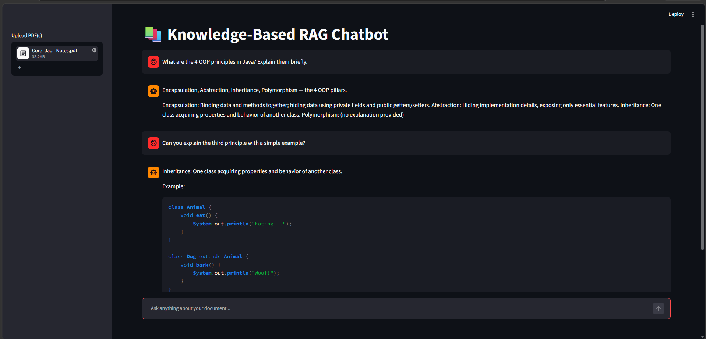

# 📚 Knowledge-Based RAG Chatbot


Project Description
---
An AI-powered Knowledge-Based Retrieval-Augmented Generation (RAG) Chatbot that allows users to upload one or more PDF documents and ask questions based only on the uploaded content. The chatbot retrieves relevant information using Hybrid Retrieval (FAISS + BM25) and generates accurate responses using Groq Llama 3.1.


## Features

- Upload one or more PDF documents
- Ask questions based only on uploaded documents
- Hybrid Retrieval using FAISS and BM25
- HuggingFace MiniLM Embeddings
- Groq Llama 3.1 LLM
- Real-time response streaming
- Query preprocessing
- Regex-based answer cleaning
- Chat history support
- Simple and interactive Streamlit UI


## Screenshots

### Chatbot Response


### Another Example




## Technologies Used

-  Python 
-  Streamlit 
-  LangChain (LCEL) 
-  Groq (Llama 3.1-8B Instant) 
-  Hugging Face Embeddings (all-MiniLM-L6-v2) 
-  FAISS 
-  BM25 Retriever 
-  PyPDF 
-  Python Dotenv 
-  Regular Expressions (Regex)


## How to Run

1. Clone the repository:
   ```
   git clone https://github.com/SreyaBondili/Knowledge-Based-RAG-Chatbot.git
   ```

2. Open the project in VS Code.

3. Install the required packages:
   ```
   pip install -r requirements.txt
   ```

4. Create a `.env` file and add your Groq API key.

5. Start the application:
   ```
   streamlit run app.py
   ```

6. Open `http://localhost:8501` in your browser.

7. Upload your PDF files and start asking questions.


## 📂 Project Structure

```
Knowledge-Based-RAG-Chatbot/
│
├── assets/
│   ├── screenshot1.png
│   └── screenshot2.png
│
├── app.py
├── requirements.txt
├── README.md
└── env_example.txt
```


## Key Highlights

- Hybrid Retrieval (FAISS + BM25)
- Semantic Search with FAISS
- Keyword Search using BM25
- Conversational Memory
- Query Cleaning
- Regex-based Answer Cleaning
- Real-time Streaming Responses
- Modular LangChain Expression Language (LCEL) Pipeline


## Future Enhancements

- Support for Word, Excel, and PowerPoint documents
- User Authentication
- Persistent Chat History
- Multi-language Support
- Cloud Deployment
- Source Citation and Highlighting


## Author

**Sreya Bondili**

GitHub: https://github.com/SreyaBondili


